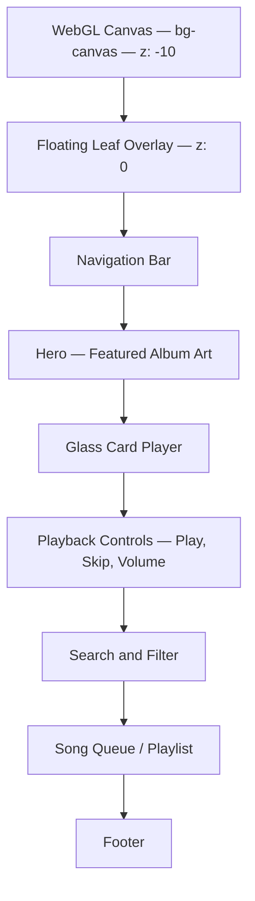

# 🎵 Albums Page Design — Implementation Guide

> How to recreate the **Albums.html** "AmpliFyer Video Player" page — a premium music/video player with glassmorphism UI, GSAP scroll animations, and botanical leaf overlays.

---

## 🖼️ Page Overview

**Albums.html** is a full-featured video/music player interface with:

- WebGL shader background canvas (shared with thoughts.html)
- Floating leaf stems (same botanical overlay system)
- GSAP-powered scroll reveal animations
- Premium glassmorphism card-based player UI
- Custom-styled range sliders for volume/progress
- Animated equalizer bars for "now playing" state
- Search with live filtering
- Song queue and playlist management
- Dark mode support

---

## 🏗️ Page Architecture



---

## 🎨 Design Differences from Thoughts Page

| Feature | thoughts.html | Albums.html |
|---|---|---|
| **Body font** | Playfair Display (serif) | Inter (sans-serif) |
| **Secondary color** | `#9a442f` (terracotta) | `#8a765d` (warm gold) |
| **Secondary container** | `#fd9076` (coral) | `#f5ebd6` (cream) |
| **GSAP** | Not used | ScrollTrigger for reveals |
| **Card style** | Scribble notes | Glass cards |
| **Dark mode** | Not supported | Class-based dark mode |
| **Music features** | None | Full player, equalizer, queue |

---

## 🪟 Glass Card Player

The main player UI uses a glassmorphism card:

```css
.glass-card {
    background: rgba(255, 255, 255, 0.45);
    backdrop-filter: blur(20px);
    -webkit-backdrop-filter: blur(20px);
    border: 1px solid rgba(255, 255, 255, 0.25);
}
```

### Dark Mode Variant
```css
.dark .glass-card {
    background: rgba(0, 0, 0, 0.3);
    border: 1px solid rgba(255, 255, 255, 0.08);
}
```

---

## 🎚️ Custom Range Sliders

Premium-styled volume and progress sliders:

```css
input[type="range"] {
    -webkit-appearance: none;
    appearance: none;
    background: rgba(0, 0, 0, 0.08);
    height: 4px;
    border-radius: 9999px;
    outline: none;
}

input[type="range"]::-webkit-slider-thumb {
    -webkit-appearance: none;
    height: 12px;
    width: 12px;
    border-radius: 9999px;
    background: #9a442f;
    cursor: pointer;
    margin-top: -4px;
    box-shadow: 0 2px 6px rgba(0,0,0,0.15);
    transition: transform 0.15s ease, background-color 0.15s ease;
}

input[type="range"]::-webkit-slider-thumb:hover {
    transform: scale(1.2);
    background: rgb(255, 45, 85);
}
```

---

## 🎵 Animated Equalizer Bars

Visual feedback for "now playing" state:

```css
@keyframes animPlayingBar {
    0%, 100% { height: 25%; }
    50% { height: 100%; }
}

.anim-playing-bar {
    animation: animPlayingBar 0.8s ease-in-out infinite alternate;
    display: inline-block;
}

/* Pause animation when music is paused */
.paused .anim-playing-bar {
    animation-play-state: paused !important;
}
```

### Usage
```html
<div class="flex items-end gap-[2px] h-4">
    <span class="anim-playing-bar w-[3px] bg-secondary rounded-full" 
          style="animation-delay: 0s;"></span>
    <span class="anim-playing-bar w-[3px] bg-secondary rounded-full" 
          style="animation-delay: 0.2s;"></span>
    <span class="anim-playing-bar w-[3px] bg-secondary rounded-full" 
          style="animation-delay: 0.4s;"></span>
</div>
```

---

## 🔍 Search Input — No-Glow Focus

Premium search field that removes default browser glow:

```css
#input-search-song:focus {
    outline: none !important;
    box-shadow: none !important;
    border-color: rgba(74, 60, 49, 0.2) !important;
    background-color: rgba(255, 255, 255, 0.4) !important;
}

.dark #input-search-song:focus {
    border-color: rgba(255, 255, 255, 0.15) !important;
    background-color: rgba(0, 0, 0, 0.2) !important;
}
```

---

## 🎭 GSAP ScrollTrigger Integration

Albums page uses GSAP for scroll-driven animations instead of the vanilla IntersectionObserver used in thoughts.html.

### CDN Setup
```html
<script src="https://cdnjs.cloudflare.com/ajax/libs/gsap/3.12.5/gsap.min.js"></script>
<script src="https://cdnjs.cloudflare.com/ajax/libs/gsap/3.12.5/ScrollTrigger.min.js"></script>
```

### Example Reveal
```javascript
gsap.from('.glass-card', {
    y: 30,
    opacity: 0,
    duration: 1,
    ease: 'power3.out',
    scrollTrigger: {
        trigger: '.glass-card',
        start: 'top 85%',
        toggleActions: 'play none none reverse'
    }
});
```

---

## 🎠 Marquee Text Scroll

For song titles that overflow their container:

```css
.marquee-container {
    overflow: hidden;
    white-space: nowrap;
    position: relative;
}

.marquee-content {
    display: inline-block;
    animation: marquee 15s linear infinite;
    padding-left: 100%;
}

@keyframes marquee {
    0% { transform: translateX(0); }
    100% { transform: translateX(-100%); }
}
```

---

## 🍃 Shared Leaf System

Albums uses the same floating leaf stem system as thoughts.html:
- Same SVG `feColorMatrix` filter
- Same `gentleSway` keyframe animation
- Same 6-stem placement pattern
- Same leaf image file (`src/leaf-branch.png`)

See [THOUGHTS-PAGE-DESIGN.md](./THOUGHTS-PAGE-DESIGN.md) for the complete leaf implementation.

---

## 🎨 Color Palette — Albums Variant

The Albums page uses a **warmer, gold-toned** secondary palette:

| Token | Thoughts | Albums | Visual Difference |
|---|---|---|---|
| `secondary` | `#9a442f` | `#8a765d` | Terracotta vs. warm gold |
| `secondary-container` | `#fd9076` | `#f5ebd6` | Coral vs. cream |
| `on-secondary-container` | `#752815` | `#5c4a37` | Deep red vs. brown |
| `secondary-fixed` | `#ffdad2` | `#faf5ea` | Pink tint vs. ivory |
| `secondary-fixed-dim` | `#ffb4a2` | `#e6dec9` | Salmon vs. khaki |
| `on-secondary-fixed` | `#3c0700` | `#4a3c31` | Dark red vs. dark brown |

All **primary colors** (greens), **surface colors**, and **tertiary colors** are identical between pages.

---

## 📋 Quick Start — Video Player Card

```html
<!DOCTYPE html>
<html lang="en" class="scroll-smooth">
<head>
    <meta charset="utf-8">
    <meta name="viewport" content="width=device-width, initial-scale=1.0">
    <title>My Player</title>
    
    <link href="https://fonts.googleapis.com/css2?family=Inter:wght@400;600;700&family=Playfair+Display:wght@400..900&display=swap" rel="stylesheet">
    <link href="https://fonts.googleapis.com/css2?family=Material+Symbols+Outlined:wght,FILL@100..700,0..1&display=block" rel="stylesheet">
    
    <script src="https://cdn.tailwindcss.com"></script>
    <script>
        tailwind.config = {
            theme: {
                extend: {
                    colors: {
                        primary: "#154212",
                        secondary: "#8a765d",
                        background: "#fbf9f8",
                        "on-surface": "#1b1c1c",
                        "on-surface-variant": "#42493e",
                        "outline-variant": "#c2c9bb",
                    },
                    fontFamily: {
                        sans: ["Inter", "sans-serif"],
                        "display-lg": ["Playfair Display", "serif"],
                    }
                }
            }
        }
    </script>
    
    <style>
        .glass-card {
            background: rgba(255,255,255,0.45);
            backdrop-filter: blur(20px);
            -webkit-backdrop-filter: blur(20px);
            border: 1px solid rgba(255,255,255,0.25);
        }
        input[type="range"] {
            -webkit-appearance: none;
            background: rgba(0,0,0,0.08);
            height: 4px;
            border-radius: 9999px;
        }
        input[type="range"]::-webkit-slider-thumb {
            -webkit-appearance: none;
            height: 12px; width: 12px;
            border-radius: 9999px;
            background: #8a765d;
            margin-top: -4px;
        }
        @keyframes animPlayingBar {
            0%, 100% { height: 25%; }
            50% { height: 100%; }
        }
        .anim-playing-bar {
            animation: animPlayingBar 0.8s ease-in-out infinite alternate;
        }
    </style>
</head>
<body class="bg-background text-on-surface font-sans min-h-screen p-6">
    
    <div class="max-w-md mx-auto">
        <div class="glass-card rounded-2xl p-6">
            <!-- Album Art -->
            <div class="aspect-square rounded-xl bg-outline-variant/20 mb-4 flex items-center justify-center">
                <span class="material-symbols-outlined text-6xl text-on-surface-variant/30">album</span>
            </div>
            
            <!-- Track Info -->
            <h2 class="font-display-lg text-xl font-bold">Track Title</h2>
            <p class="text-on-surface-variant text-sm">Artist Name</p>
            
            <!-- Progress -->
            <div class="mt-4">
                <input type="range" class="w-full" value="35" min="0" max="100">
                <div class="flex justify-between text-xs text-on-surface-variant mt-1">
                    <span>1:23</span>
                    <span>3:45</span>
                </div>
            </div>
            
            <!-- Controls -->
            <div class="flex items-center justify-center gap-6 mt-4">
                <button class="text-on-surface-variant hover:text-on-surface transition-colors">
                    <span class="material-symbols-outlined">skip_previous</span>
                </button>
                <button class="w-12 h-12 rounded-full bg-secondary text-white flex items-center justify-center">
                    <span class="material-symbols-outlined text-2xl">play_arrow</span>
                </button>
                <button class="text-on-surface-variant hover:text-on-surface transition-colors">
                    <span class="material-symbols-outlined">skip_next</span>
                </button>
            </div>
            
            <!-- Equalizer -->
            <div class="flex items-end justify-center gap-[2px] h-4 mt-4">
                <span class="anim-playing-bar w-[3px] bg-secondary rounded-full" style="animation-delay: 0s;"></span>
                <span class="anim-playing-bar w-[3px] bg-secondary rounded-full" style="animation-delay: 0.2s;"></span>
                <span class="anim-playing-bar w-[3px] bg-secondary rounded-full" style="animation-delay: 0.4s;"></span>
            </div>
        </div>
    </div>
</body>
</html>
```

---

> See [DESIGN-SYSTEM.md](./DESIGN-SYSTEM.md) for the complete color token reference and [README.md](./README.md) for the system architecture.
