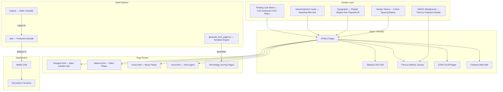
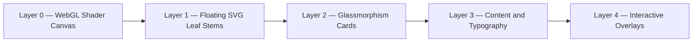
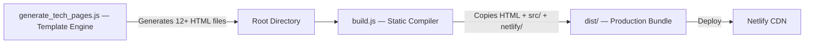

# 🌿 Garden Design System

> The complete design language, architecture, and implementation guide behind **Thoughts Garden** — a premium botanical-themed digital portfolio built with pure HTML, CSS, JavaScript, Tailwind CSS, Three.js, and GSAP.

---

## 📂 Repository Structure

```
Garden-Design/
├── README.md                    # This file — overview & architecture
├── DESIGN-SYSTEM.md             # Color palette, typography, spacing tokens
├── THOUGHTS-PAGE-DESIGN.md      # thoughts.html page implementation guide
└── ALBUMS-PAGE-DESIGN.md        # Albums.html page implementation guide
```

---

## 🏗️ High-Level System Architecture



---

## 🎨 Design Philosophy

### Core Principles

| Principle | Implementation |
|---|---|
| **Botanical Aesthetic** | Organic leaf stems, earthy color palette, nature-inspired textures |
| **Glassmorphism** | Frosted glass cards with `backdrop-filter: blur(20px)` |
| **Motion-First** | Every element animates — scroll reveals, hover lifts, swaying leaves |
| **Material Design 3** | Full M3 color token system with 40+ semantic color roles |
| **Responsive** | Mobile-first with Tailwind breakpoints `md:` and `lg:` |
| **Performance** | WebGL shader runs on GPU, CSS animations use `will-change` |

### Visual Layer Stack



---

## 🔤 Typography

| Role | Font | Weight | Usage |
|---|---|---|---|
| Display / Headlines | **Playfair Display** | 400–900 | Page titles, section headers |
| Body Text | **Inter** | 400, 600, 700 | Paragraphs, labels (Albums page) |
| Handwritten | **Playwrite ID** | 100–400 | Scribble notes, personal quotes |
| Icons | **Material Symbols Outlined** | Variable | UI action icons |

---

## 🎨 Color Palette — Material Design 3

### Primary Colors — Forest Green Family

| Token | Hex | Usage |
|---|---|---|
| `primary` | `#154212` | Primary text, key actions |
| `primary-container` | `#2d5a27` | Card backgrounds, containers |
| `primary-fixed` | `#bcf0ae` | Light accents, tags |
| `primary-fixed-dim` | `#a1d494` | Muted green accents |
| `surface-tint` | `#3b6934` | Overlay tints |

### Secondary Colors

| Token | Hex | Usage |
|---|---|---|
| `secondary` thoughts | `#9a442f` | CTA buttons, warm accents |
| `secondary` albums | `#8a765d` | Warm gold/brown accents |
| `secondary-container` | `#fd9076` or `#f5ebd6` | Soft containers |

### Surface and Background

| Token | Hex | Usage |
|---|---|---|
| `background` | `#fbf9f8` | Page background — warm off-white |
| `surface` | `#fbf9f8` | Card surfaces |
| `surface-container` | `#efeded` | Elevated containers |
| `on-surface` | `#1b1c1c` | Primary text color |
| `on-surface-variant` | `#42493e` | Secondary text color |
| `outline-variant` | `#c2c9bb` | Borders, dividers |

### Accent Colors — Used in Effects

| Color | Hex | Usage |
|---|---|---|
| Rose Gold | `#d98270` | Rotating border glow streak 1 |
| Cream Glow | `#eed8a1` | Rotating border glow streak 1 |
| Sage Green | `#6b8f71` | Rotating border glow streak 2 |
| Light Sage | `#abc9a5` | Rotating border glow streak 2 |
| Scribble BG | `#fdfcf7` | Notepad card backgrounds |
| Scribble Border | `#f2edd9` | Notepad card borders |

---

## 📐 Spacing System

| Token | Value | Usage |
|---|---|---|
| `unit` | `8px` | Base spacing unit |
| `stack-sm` | `12px` | Small vertical spacing |
| `stack-md` | `24px` | Medium vertical spacing |
| `stack-lg` | `48px` | Large section spacing |
| `gutter` | `24px` | Column gutters |
| `margin-mobile` | `20px` | Mobile horizontal padding |
| `margin-desktop` | `64px` | Desktop horizontal padding |
| `container-max` | `1140px` | Max content width |

---

## 🔲 Border Radius

| Token | Value |
|---|---|
| Default | `1rem` 16px |
| Large | `2rem` 32px |
| XL | `3rem` 48px |
| Full | `9999px` Pill |

---

## 🍃 Floating Leaf System

The botanical leaf overlay uses **6 positioned leaf stems** placed at corners and mid-sections of the viewport. Each leaf uses a `gentleSway` CSS keyframe animation and SVG color matrix filter to remove white backgrounds.

### Implementation Example

```html
<!-- SVG Filter Definition (removes white background from leaf images) -->
<svg width="0" height="0" style="position: absolute;">
    <defs>
        <filter id="remove-white">
            <feColorMatrix type="matrix" values="
                1 0 0 0 0
                0 1 0 0 0
                0 0 1 0 0
                -1.2 -1.2 -1.2 3.2 0
            "/>
        </filter>
    </defs>
</svg>

<!-- Floating Leaf (Top Left) -->
<div class="fixed inset-0 pointer-events-none z-0 overflow-hidden">
    
</div>
```

```css
@keyframes gentleSway {
    0%, 100% {
        transform: var(--base-trans) rotate(var(--base-rot)) 
                   translateY(0px) translateX(0px);
    }
    50% {
        transform: var(--base-trans) rotate(calc(var(--base-rot) + 4deg)) 
                   translateY(-8px) translateX(4px);
    }
}

.swaying-leaf {
    animation: gentleSway 8s ease-in-out infinite;
    pointer-events: none;
    user-select: none;
}
```

---

## 🪟 Glassmorphism Card System

```css
.glass-card {
    background: rgba(255, 255, 255, 0.45);
    backdrop-filter: blur(20px);
    -webkit-backdrop-filter: blur(20px);
    border: 1px solid rgba(255, 255, 255, 0.25);
}
```

### Scribble Notepad Card

```css
.scribble-note {
    background-color: #fdfcf7;
    border: 1px solid #f2edd9;
    box-shadow: 0 4px 15px rgba(161, 142, 107, 0.08);
    position: relative;
}

/* Dog-ear fold corner */
.scribble-note::after {
    content: '';
    position: absolute;
    bottom: 0; right: 0;
    width: 0; height: 0;
    border-style: solid;
    border-width: 0 0 12px 12px;
    border-color: transparent transparent #eae4cd transparent;
}

.scribble-note:hover {
    transform: translateY(-2px) rotate(0deg) !important;
    box-shadow: 0 8px 25px rgba(161, 142, 107, 0.12);
}
```

---

## 🌊 WebGL Background Shader

The background canvas runs a **Three.js fragment shader** that renders a soft, organic gradient animation on the GPU.

```javascript
const canvas = document.getElementById('bg-canvas');
const renderer = new THREE.WebGLRenderer({ canvas, alpha: true });
const scene = new THREE.Scene();
const camera = new THREE.OrthographicCamera(-1, 1, 1, -1, 0, 1);

const shaderMaterial = new THREE.ShaderMaterial({
    uniforms: {
        uTime: { value: 0.0 },
        uResolution: { value: new THREE.Vector2() }
    },
    vertexShader: `void main() { 
        gl_Position = vec4(position, 1.0); 
    }`,
    fragmentShader: `
        uniform float uTime;
        uniform vec2 uResolution;
        void main() {
            vec2 uv = gl_FragCoord.xy / uResolution.xy;
            float gradient = smoothstep(0.0, 1.0, uv.y);
            vec3 color = mix(
                vec3(0.98, 0.97, 0.95),
                vec3(0.95, 0.96, 0.93),
                gradient + sin(uTime * 0.3) * 0.02
            );
            gl_FragColor = vec4(color, 0.4);
        }
    `,
    transparent: true
});

const plane = new THREE.Mesh(
    new THREE.PlaneGeometry(2, 2), 
    shaderMaterial
);
scene.add(plane);

function animate() {
    shaderMaterial.uniforms.uTime.value += 0.01;
    renderer.render(scene, camera);
    requestAnimationFrame(animate);
}
animate();
```

---

## 📜 Scroll Reveal Animation

```css
.scroll-reveal {
    opacity: 0;
    transform: translateY(20px);
    transition: opacity 1s cubic-bezier(0.16, 1, 0.3, 1), 
                transform 1s cubic-bezier(0.16, 1, 0.3, 1);
    will-change: transform, opacity;
}

.scroll-reveal.visible {
    opacity: 1;
    transform: translateY(0);
}
```

```javascript
const observer = new IntersectionObserver((entries) => {
    entries.forEach(entry => {
        if (entry.isIntersecting) {
            entry.target.classList.add('visible');
        }
    });
}, { threshold: 0.1, rootMargin: '0px 0px -50px 0px' });

document.querySelectorAll('.scroll-reveal').forEach(el => {
    observer.observe(el);
});
```

---

## 🔁 Technology Marquee Loop

```css
@keyframes marquee {
    0% { transform: translateX(0); }
    100% { transform: translateX(-33.333%); }
}

.animate-marquee {
    display: flex;
    animation: marquee 45s linear infinite;
}

.animate-marquee:hover {
    animation-play-state: paused;
}

.marquee-fade-mask {
    mask-image: linear-gradient(
        to right, transparent, white 15%, white 85%, transparent
    );
}
```

---

## 🔄 Build Pipeline



The **template engine** uses a data-driven approach:

```javascript
const techData = {
    html: {
        title: "HTML5 Core",
        category: "Web Core",
        target_percent: 98,
        primaryColor: "#1b4332",
        secondaryColor: "#52b788",
        backgroundColor: "#f4f9f4",
        skills: ["Semantic markup", "SEO configurations"],
    },
};

const template = `<!DOCTYPE html>...{{TITLE}}...`;

for (const key in techData) {
    let content = template
        .replace(/{{TITLE}}/g, techData[key].title)
        .replace(/{{PRIMARY_COLOR}}/g, techData[key].primaryColor);
    fs.writeFileSync(`${key}.html`, content);
}
```

---

## 📋 Quick Start — Creating a Garden-Style Page

```html
<!DOCTYPE html>
<html lang="en" class="scroll-smooth">
<head>
    <meta charset="utf-8">
    <meta name="viewport" content="width=device-width, initial-scale=1.0">
    <title>My Garden Page</title>
    
    <link href="https://fonts.googleapis.com/css2?family=Playfair+Display:wght@400..900&display=swap" rel="stylesheet">
    
    <script src="https://cdn.tailwindcss.com"></script>
    <script>
        tailwind.config = {
            theme: {
                extend: {
                    colors: {
                        primary: "#154212",
                        secondary: "#9a442f",
                        background: "#fbf9f8",
                        "on-surface": "#1b1c1c",
                        "outline-variant": "#c2c9bb",
                    },
                    fontFamily: {
                        sans: ["Playfair Display", "serif"],
                    }
                }
            }
        }
    </script>
    
    <style>
        .glass-card {
            background: rgba(255, 255, 255, 0.45);
            backdrop-filter: blur(20px);
            border: 1px solid rgba(255, 255, 255, 0.25);
        }
        .scroll-reveal {
            opacity: 0; transform: translateY(20px);
            transition: all 1s cubic-bezier(0.16, 1, 0.3, 1);
        }
        .scroll-reveal.visible { opacity: 1; transform: translateY(0); }
    </style>
</head>
<body class="bg-background text-on-surface font-sans min-h-screen p-6">
    
    <div class="max-w-[1140px] mx-auto">
        <div class="glass-card rounded-2xl p-8 scroll-reveal">
            <h1 class="text-3xl font-bold text-primary">Hello, Garden</h1>
            <p class="mt-3 text-on-surface/70">
                Your botanical-themed content goes here.
            </p>
        </div>
    </div>
    
    <script>
        const observer = new IntersectionObserver((entries) => {
            entries.forEach(e => {
                if (e.isIntersecting) e.target.classList.add('visible');
            });
        }, { threshold: 0.1 });
        document.querySelectorAll('.scroll-reveal').forEach(el => observer.observe(el));
    </script>
</body>
</html>
```

---

## 📜 License

This design system documentation is provided for educational and reference purposes.  
The source code of Thoughts Garden is proprietary.

---

> *"Design is not just what it looks like. Design is how it works."* — Steve Jobs
