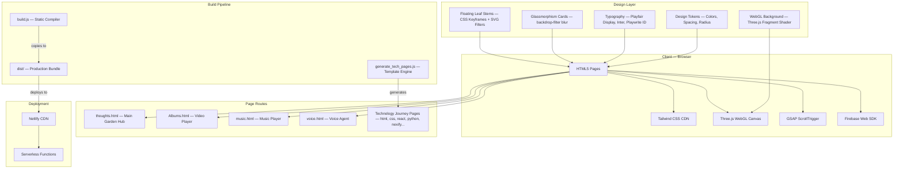
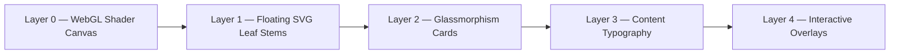
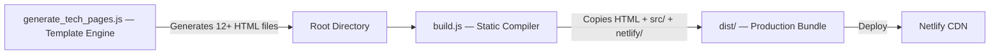

# 🌿 Garden Design System

> The complete design language, architecture, and implementation guide behind **Thoughts Garden** — a premium botanical-themed digital portfolio built with pure HTML, CSS, JavaScript, Tailwind CSS, Three.js, and GSAP.

[](.)
[](.)
[](.)
[](.)

---

## 📂 Repository Structure

```
Garden-Design/
├── README.md                    ← You are here — overview & architecture
├── DESIGN-SYSTEM.md             ← Color palette, typography, spacing tokens
├── THOUGHTS-PAGE-DESIGN.md      ← thoughts.html page implementation guide
└── ALBUMS-PAGE-DESIGN.md        ← Albums.html page implementation guide
```

---

## 🏗️ High-Level System Architecture



---

## 🎨 Design Philosophy

| Principle | Implementation |
|---|---|
| **Botanical Aesthetic** | Organic leaf stems, earthy color palette, nature-inspired textures |
| **Glassmorphism** | Frosted glass cards with `backdrop-filter: blur(20px)` |
| **Motion-First** | Every element animates — scroll reveals, hover lifts, swaying leaves |
| **Material Design 3** | Full M3 color token system with 40+ semantic color roles |
| **Responsive** | Mobile-first layout with Tailwind breakpoints `md:` and `lg:` |
| **GPU Performance** | WebGL shader runs on GPU, CSS animations use `will-change` |

### Visual Layer Stack



---

## ⚡ Technology Stack

| Category | Technology | Purpose |
|---|---|---|
| **Structure** | HTML5 | Semantic page structure |
| **Styling** | Tailwind CSS CDN + Custom CSS | Utility-first + custom animations |
| **3D Background** | Three.js r128 | WebGL fragment shader canvas |
| **Scroll Animations** | GSAP + ScrollTrigger | Smooth scroll-driven reveals |
| **Typography** | Google Fonts | Playfair Display, Inter, Playwrite ID |
| **Icons** | Material Symbols Outlined | Variable-weight icon system |
| **Backend** | Firebase Firestore | Visitor tracking, testimonials, subscriptions |
| **Hosting** | Netlify CDN | Static deployment with serverless functions |
| **Build** | Node.js scripts | Template generation + static compilation |

---

## 🔄 Build Pipeline



### How It Works

1. **Template Engine** (`generate_tech_pages.js`) — Takes a data object with page metadata (title, colors, skills, percentages) and generates individual HTML files from a template using `{{PLACEHOLDER}}` replacement
2. **Static Compiler** (`build.js`) — Copies all HTML files, `src/` assets, and `netlify/` functions into the `dist/` folder
3. **Deployment** — The `dist/` folder is deployed to Netlify CDN

---

## 🧠 Skills and Tools Used to Build

### Languages
- **HTML5** — Semantic markup, accessibility, SEO
- **CSS3** — Custom animations, glassmorphism, SVG filters
- **JavaScript (ES6+)** — Module scripts, IntersectionObserver, WebGL
- **GLSL** — Fragment shader for background gradient

### Frameworks and Libraries
- **Tailwind CSS** — Utility-first responsive styling
- **Three.js** — WebGL 3D rendering engine
- **GSAP + ScrollTrigger** — Production-grade scroll animations
- **Firebase SDK** — Client-side Firestore database

### Design Tools and Techniques
- **Material Design 3** — Full color token system
- **Glassmorphism** — Frosted glass with backdrop-filter
- **SVG feColorMatrix** — Chroma key filter for leaf stems
- **CSS Custom Properties** — Dynamic animation transforms
- **IntersectionObserver** — Scroll-driven reveal system

---

## 🚀 Nexify AI — Model Portfolio

This project also showcases the **Nexify AI** model family, a suite of AI models developed over approximately 6 months:

| Model | Type | Description |
|---|---|---|
| **Nexify 2.5 Pro** | ML Model | 5GB local model, runs on RAM, cloud-powered by NVIDIA hosting |
| **Nexify v3 Flash** | Fast Inference | Optimized for speed and low-latency responses |
| **Nexify 3.5 Pro** | Advanced | Enhanced reasoning and context understanding |
| **Nexify i2** | Hybrid | Intelligent hybrid combining multiple model architectures |
| **Nexify i4** | Hybrid | Advanced hybrid model with multi-modal capabilities |
| **Nexify i7** | Hybrid | Premium hybrid model — flagship of the Nexify family |

### Nexify Tech Stack
- **Python** — Core ML training and model architecture
- **TypeScript** — API layer and type-safe integrations
- **LangChain** — LLM orchestration and chaining
- **NVIDIA Cloud** — GPU hosting and inference
- **Local ML** — 5GB base model running on local RAM

> The first model took approximately 2 months to develop. The full suite spans nearly 6 months of development.

---

## 📋 Quick Start

See [THOUGHTS-PAGE-DESIGN.md](./THOUGHTS-PAGE-DESIGN.md) for a complete quick-start template to create your own Garden-style page.

---

## 📜 License

This design system documentation is provided for educational and reference purposes.  
The source code of Thoughts Garden is proprietary.

---

> *"Design is not just what it looks like. Design is how it works."* — Steve Jobs
