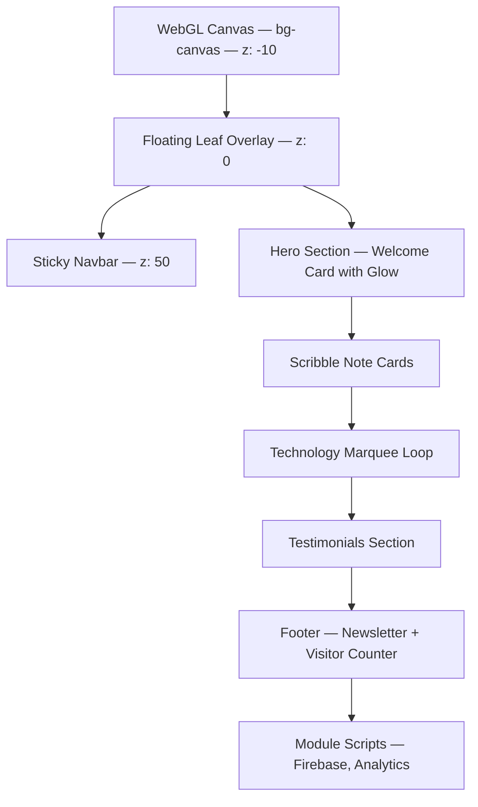

# 🌿 Thoughts Page Design — Implementation Guide

> How to recreate the **thoughts.html** "Digital Garden" page — the main hub of the Thoughts Garden portfolio. This document covers the visual design, animations, canvas leaf system, and interactive components.

---

## 🖼️ Page Overview

**thoughts.html** is a full-featured digital garden landing page with:

- WebGL shader background canvas
- 6 floating botanical leaf stems with CSS animations
- Typewriter text reveals
- Scribble notepad cards with dog-ear folds
- Rotating conic gradient border glow
- Technology marquee loop
- Scroll-driven reveal animations
- Firebase-powered visitor counter
- Testimonial submission system
- Newsletter subscription form

---

## 🏗️ Page Architecture



---

## 🌊 WebGL Background Canvas

The background is a full-viewport `<canvas>` element rendered by Three.js with a custom GLSL fragment shader.

### Structure
```html
<canvas class="fixed inset-0 w-full h-full -z-10 pointer-events-none" 
        id="bg-canvas"></canvas>
```

### Key Properties
- **Position**: Fixed, fills entire viewport
- **Z-index**: -10 (behind everything)
- **Interaction**: `pointer-events: none` — clicks pass through
- **Shader**: Soft animated gradient between warm off-white and sage tint
- **Performance**: Runs on GPU via WebGL

---

## 🍃 Floating Leaf System — 6 Stems

Six `` elements are positioned absolutely inside a fixed overlay. Each uses:

1. **SVG feColorMatrix filter** — Removes the white background from leaf PNGs
2. **CSS Custom Properties** — `--base-trans` and `--base-rot` for unique transforms
3. **`gentleSway` keyframe** — 8-second infinite sway animation

### Leaf Placement Map

| Position | Transform | Size | Opacity |
|---|---|---|---|
| Top Left | `scale(1), rot(-35deg)` | 24rem | 0.75 |
| Top Right | `scaleX(-1), rot(35deg)` | 24rem | 0.75 |
| Mid Left | `rotate(70deg)` | 20rem | 0.45 |
| Mid Right | `scaleX(-1), rot(-70deg)` | 22rem | 0.50 |
| Bottom Left | `rotate(145deg)` | 25rem | 0.70 |
| Bottom Right | `scaleX(-1), rot(-145deg)` | 25rem | 0.70 |

### CSS Filter Stack
```css
filter: url(#remove-white) brightness(1.05) saturate(0.85) contrast(0.95) blur(0.5px);
```

Each filter does:
- `url(#remove-white)` — SVG chroma key removes white
- `brightness(1.05)` — Slightly brightens
- `saturate(0.85)` — Desaturates for muted look
- `contrast(0.95)` — Softens contrast
- `blur(0.5px)` — Subtle depth-of-field effect

---

## ✨ Welcome Card — Rotating Border Glow

The hero welcome card uses a **conic-gradient `::before` pseudo-element** that rotates infinitely to create a premium border glow effect.

### Conic Gradient Colors

```css
background: conic-gradient(
    from 0deg,
    transparent 15%,
    #d98270 21%,    /* Rose Gold — Streak 1 */
    #eed8a1 24%,    /* Cream Glow — Streak 1 */
    transparent 30%,
    transparent 65%,
    #6b8f71 71%,    /* Sage Green — Streak 2 */
    #abc9a5 74%,    /* Light Sage — Streak 2 */
    transparent 80%
);
animation: rotateGlow 7s linear infinite;
```

### How It Works
1. The `::before` is sized 400% x 400% of the card
2. Positioned at `-150%` top and left (centered)
3. Rotates continuously with `transform: rotate()`
4. The card has `overflow: hidden` — only the border edge is visible
5. An inner `<div>` covers the center, revealing just the glowing edge

---

## 📝 Scribble Note Cards

Notebook-style cards with:
- Warm cream background (`#fdfcf7`)
- Subtle parchment border (`#f2edd9`)
- **Dog-ear fold** in bottom-right corner using CSS border trick
- Hover lift animation with `translateY(-2px)`
- Ruled paper lines using `background-image: linear-gradient`

### Ruled Paper Effect
```css
.ruled-paper {
    background-image: linear-gradient(
        rgba(59, 105, 52, 0.08) 1px, 
        transparent 1px
    );
    background-size: 100% 1.8rem;
    line-height: 1.8rem;
}
```

---

## 🔄 Technology Marquee

An infinitely scrolling horizontal loop of technology SVG logos.

### Key Implementation Details
- Content is **duplicated 3x** (original + 2 clones) for seamless looping
- `translateX(-33.333%)` moves exactly one-third (one full set)
- Fade mask applied via CSS `mask-image` gradient
- Pauses on hover with `animation-play-state: paused`
- Speed: 45 seconds per full loop

---

## 📜 Scroll Reveal System

Uses `IntersectionObserver` to add `.visible` class when elements enter viewport.

### Configuration
```javascript
{
    threshold: 0.1,           // 10% visibility triggers
    rootMargin: '0px 0px -50px 0px'  // 50px offset from bottom
}
```

### Animation
- **Duration**: 1 second
- **Easing**: `cubic-bezier(0.16, 1, 0.3, 1)` — smooth deceleration
- **Transform**: `translateY(20px) → translateY(0)` + opacity `0 → 1`
- **Performance**: `will-change: transform, opacity`

---

## 🎤 Typewriter Text Effect

```css
@keyframes typewriting {
    from { width: 0; }
    to { width: 100%; }
}

.typewriter-text {
    display: inline-block;
    overflow: hidden;
    white-space: nowrap;
    width: 0;
    animation: typewriting 1.5s steps(20, end) forwards;
    animation-delay: 500ms;
}
```

---

## 📊 Visitor Counter Card

A glassmorphism statistics card in the footer showing total garden visitors. Uses Firebase Firestore to track unique visitors via localStorage visitor IDs.

### Visual Design
- Glass background with blur
- 4-digit odometer-style number display
- Each digit in its own bordered box
- Subtle forest-green tint matching the botanical theme

---

## 🔗 Inline Reveal Animation

Text elements that reveal with a clip-path wipe:

```css
@keyframes inlineReveal {
    from {
        clip-path: polygon(0 0, 0 0, 0 100%, 0% 100%);
        opacity: 0;
    }
    to {
        clip-path: polygon(0 0, 100% 0, 100% 100%, 0 100%);
        opacity: 1;
    }
}

.inline-reveal {
    opacity: 0;
    animation: inlineReveal 1s cubic-bezier(0.16, 1, 0.3, 1) forwards;
}
```

---

## 📱 Mobile Considerations

- Floating AI voice avatar button (bottom-right, mobile only)
- Mid-section leaves hidden on mobile (`hidden lg:block`)
- Navbar collapses padding on scroll
- Container padding switches from `margin-mobile` (20px) to `margin-desktop` (64px)

---

## 📋 Quick Start Template

```html
<!DOCTYPE html>
<html lang="en" class="scroll-smooth">
<head>
    <meta charset="utf-8">
    <meta name="viewport" content="width=device-width, initial-scale=1.0">
    <title>My Garden Page</title>
    
    <link href="https://fonts.googleapis.com/css2?family=Playfair+Display:wght@400..900&display=swap" rel="stylesheet">
    <script src="https://cdn.tailwindcss.com"></script>
    <script>
        tailwind.config = {
            theme: {
                extend: {
                    colors: {
                        primary: "#154212",
                        "primary-container": "#2d5a27",
                        secondary: "#9a442f",
                        background: "#fbf9f8",
                        "on-surface": "#1b1c1c",
                        "on-surface-variant": "#42493e",
                        "outline-variant": "#c2c9bb",
                        "surface-tint": "#3b6934",
                        "primary-fixed-dim": "#a1d494",
                    },
                    fontFamily: { sans: ["Playfair Display", "serif"] },
                    borderRadius: { DEFAULT: "1rem", lg: "2rem" }
                }
            }
        }
    </script>
    
    <style>
        @keyframes gentleSway {
            0%, 100% { transform: rotate(-35deg) translateY(0); }
            50% { transform: rotate(-31deg) translateY(-8px); }
        }
        .swaying-leaf {
            animation: gentleSway 8s ease-in-out infinite;
            pointer-events: none;
        }
        .glass-card {
            background: rgba(255,255,255,0.45);
            backdrop-filter: blur(20px);
            border: 1px solid rgba(255,255,255,0.25);
        }
        .scribble-note {
            background: #fdfcf7;
            border: 1px solid #f2edd9;
            box-shadow: 0 4px 15px rgba(161,142,107,0.08);
        }
        .scroll-reveal {
            opacity: 0; transform: translateY(20px);
            transition: all 1s cubic-bezier(0.16,1,0.3,1);
        }
        .scroll-reveal.visible { opacity: 1; transform: translateY(0); }
    </style>
</head>
<body class="bg-background text-on-surface font-sans min-h-screen pt-24 pb-12">
    
    <!-- Hero -->
    <div class="max-w-[1140px] mx-auto px-5 md:px-16">
        <div class="glass-card rounded-2xl p-8 scroll-reveal">
            <h1 class="text-4xl font-bold text-primary">
                Welcome to My Garden
            </h1>
            <p class="mt-4 text-on-surface-variant text-lg">
                A botanical-themed digital space.
            </p>
        </div>
        
        <!-- Scribble Card -->
        <div class="scribble-note rounded-xl p-6 mt-8 scroll-reveal">
            <h3 class="font-bold text-on-surface">A Quick Note</h3>
            <p class="mt-2 text-on-surface-variant text-sm">
                This card mimics a notebook page with warm cream tones.
            </p>
        </div>
    </div>
    
    <script>
        const obs = new IntersectionObserver(
            (es) => es.forEach(e => { if(e.isIntersecting) e.target.classList.add('visible'); }),
            { threshold: 0.1 }
        );
        document.querySelectorAll('.scroll-reveal').forEach(el => obs.observe(el));
    </script>
</body>
</html>
```
